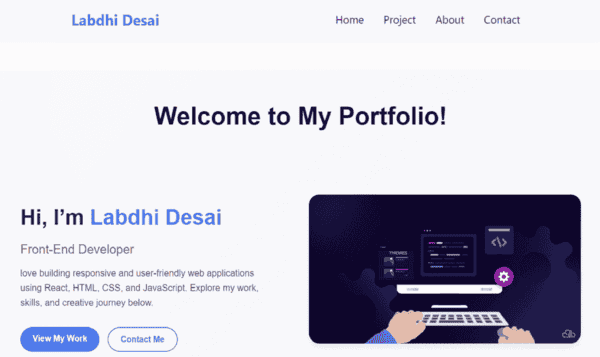
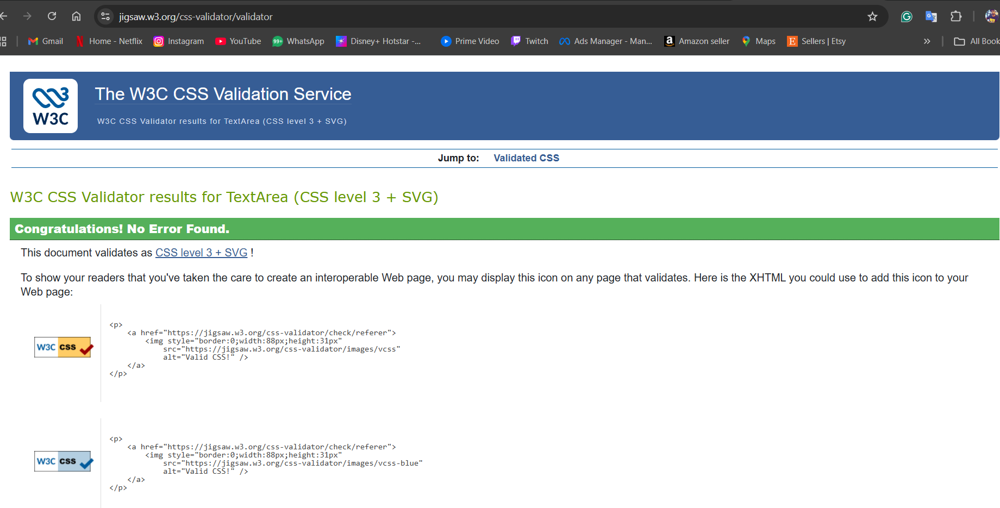

#  My Portfolio Website

Welcome to my personal portfolio! This website showcases my skills, projects, and experience as a web developer. It’s built to be fully responsive, user-friendly, and visually appealing.

##  Features

- **About Me:** A section introducing myself and my skills
- **Projects Showcase:** Highlights of my best work 
- **Contact Form:** Easy way to reach out to me
- **Responsive Design:** Looks great on desktop, tablet, and mobile
- **Smooth Animations:** Interactive UI using CSS & JavaScript

##  Tech Stack

- **Frontend:** HTML5, CSS3, JavaScript, React
- **Version Control:** Git & GitHub
- **Hosting:** GitHub Pages
- **Tools:** VS Code

##  Screenshots

  

##  Installation & Setup

1. Clone this repository:  

https://github.com/ldesai1704/portfolio_project.git

2. Installation:

npm install

npm start

##  Live Demo
[click here](https://ldesai1704.github.io/portfolio_project)

## Testing
 
 I used [this website](https://jigsaw.w3.org/css-validator)  to valid my CSS

 To see Below: 

